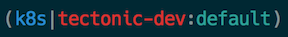

Kubernetes prompt for bash and zsh
==================================

A Kubernetes (k8s) bash and zsh prompt that displays the current cluster
context and the namespace.

Inspired by several tools used to simplify usage of kubectl



## Prompt Structure

The prompt layout is:

```
(k8s|<cluster>:<namespace>)
```

## Install

1. Clone this repository
2. Source the kube-prompt.sh in your ~./.zshrc or your ~/.bashrc

```
source path/k8s-prompt.sh
PROMPT='$(kube-prompt)'
```
