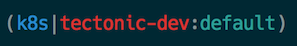

kube-ps1: Kubernetes prompt for bash and zsh
============================================

A script that lets you add the current Kubernetes context and namespace configured
on `kubectl` to your Bash/Zsh prompt strings (i.e. the `$PS1`).

Inspired by several tools used to simplify usage of `kubectl`.




## Installing

1. Clone this repository
2. Source the kube-ps1.sh in your `~/.zshrc` or your `~/.bashrc`

For Zsh:
```sh
source /path/to/kube-ps1.sh
PROMPT='$(kube_ps1)'$PROMPT
```

For Bash:
```sh
source /path/to/kube-ps1.sh
PS1="[\u@\h \W \$(kube_ps1)]\$ "
```

## Requirements

The default prompt assumes you have the `kubectl` command line utility installed.
It can be obtained here:

[Install and Set up kubectl](https://kubernetes.io/docs/tasks/tools/install-kubectl/)

If using this with OpenShift, the `oc` tool needs installed.  It can be obtained from here:

[OC Client Tools](https://www.openshift.org/download.html)

## Helper utilities

There are several great tools that make using kubectl very enjoyable:

- [`kubectx` and `kubens`](https://github.com/ahmetb/kubectx) are great for
fast switching between clusters and namespaces.

## Prompt Structure

The default prompt layout is:

```
(<symbol>|<cluster>:<namespace>)
```

## Enabling/Disabling

If you want to stop showing Kubernetes status on your prompt string temporarily
run `kubeoff`. You can enable it again by running `kubeon`.

## Customization

The default settings can be overridden in `~/.bashrc` or `~/.zshrc` by setting
the following environment variables:

| Variable | Default | Meaning |
| :------- | :-----: | ------- |
| `KUBE_PS1_BINARY_DEFAULT` | `true` | Set default binary to `kubectl` |
| `KUBE_PS1_BINARY` | `kubectl` | Kubernetes binary to use |
| `KUBE_PS1_NS_ENABLE` | `true` | Display the namespace. If set to `false`, this will also disable `KUBE_PS1_DIVIDER` |
| `KUBE_PS1_PREFIX` | `(` | Prompt opening character  |
| `KUBE_PS1_SYMBOL_ENABLE` | `true ` | Display the prompt Symbol. If set to `false`, this will also disable `KUBE_PS1_DIVIDER` |
| `KUBE_PS1_SYMBOL_DEFAULT` | `⎈ ` | Default prompt symbol. Unicode `\u2388` |
| `KUBE_PS1_SYMBOL_USE_IMG` | `false` | Use Kubernetes img as the symbol: ☸️   Unicode `\u2638` |
| `KUBE_PS1_SEPARATOR` | &#124; | Separator between symbol and cluster name |
| `KUBE_PS1_DIVIDER` | `:` | Separator between cluster and namespace |
| `KUBE_PS1_SUFFIX` | `)` | Prompt closing character |

For terminals that do not support UTF-8, the symbol will be replaced with the
string `k8s`.

To disable a feature, set it to an empty string:

```
KUBE_PS1_SEPARATOR=''
```

## Colors

The default colors are set with the following environment variables:

| Variable | Default | Meaning |
| :------- | :-----: | ------- |
| `KUBE_PS1_SYMBOL_COLOR` | `blue` | Set default color of the Kubernetes symbol |
| `KUBE_PS1_CTX_COLOR` | `red` | Set default color of the cluster context |
| `KUBE_PS1_NS_COLOR` | `cyan` | Set default color of the cluster namespace |

Blue was used for the default symbol to match the Kubernetes color as closely
as possible. Red was chosen as the cluster name to stand out, and cyan for the
namespace.

Set the variable to a null string if you do not want color.

#### ZSH

In zsh, names are only usable for the following colors: `black, red,
green, yellow, blue, magenta, cyan, and white`.

#### Bash

For bash, the appropriate escape sequences must be used in place of the color
names.  The default colors assigned have the following escape ANSI escape
sequences and tput capabilities:

```
tput:
blue: $(tput setaf 33)
red: $(tput setaf 1)
cyan: $(tput setaf 37)

ANSI:
blue: \e[34m
red:  \e[31m
cyan: \e[36m
```

## Contributors

* [Ahmet Alp Balkan](https://github.com/ahmetb)
* Jared Yanovich
