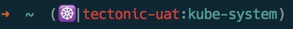
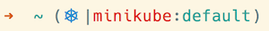
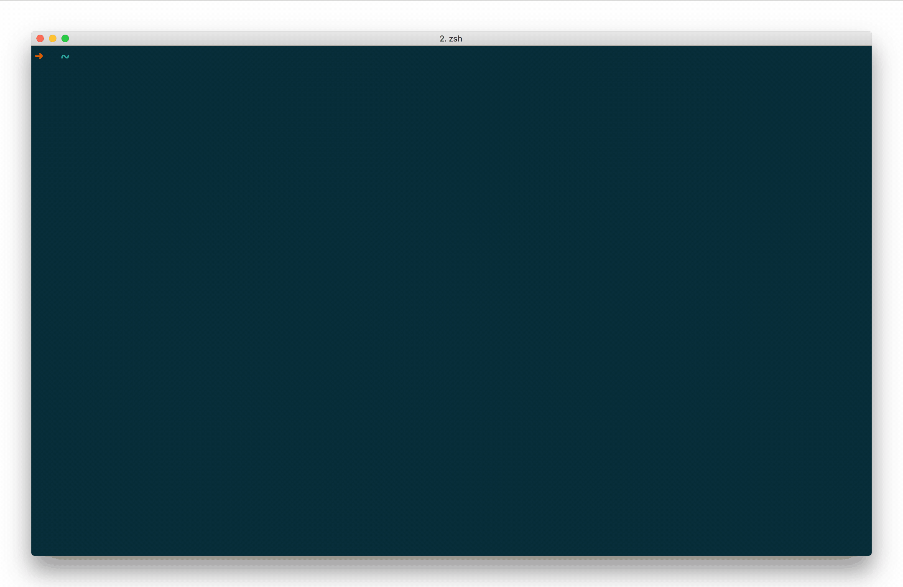

kube-ps1: Kubernetes prompt for bash and zsh
============================================

A script that lets you add the current Kubernetes context and namespace configured
on `kubectl` to your Bash/Zsh prompt strings (i.e. the `$PS1`).

Inspired by several tools used to simplify usage of `kubectl`.








## Installing

This project is now available in brew ports!

```
$ brew update
$ brew install kube-ps1
```

1. Clone this repository
2. Source the kube-ps1.sh in your `~/.zshrc` or your `~/.bashrc`

For Zsh:
```sh
source /path/to/kube-ps1.sh
PROMPT='$(kube_ps1)'$PROMPT
```

For Bash:
```sh
source /path/to/kube-ps1.sh
PS1="[\u@\h \W \$(kube_ps1)]\$ "
```

## Requirements

The default prompt assumes you have the `kubectl` command line utility installed.
Official installation instructions and binaries are available:

[Install and Set up kubectl](https://kubernetes.io/docs/tasks/tools/install-kubectl/)

If using this with OpenShift, the `oc` tool needs installed.  It can be obtained
from brew ports:

```
brew install openshift-cli
```
or the source can be downloaded:

[OC Client Tools](https://www.openshift.org/download.html)

Set the binary to `oc` with the following environment variable:

```
KUBE_PS1_BINARY=oc
```

If either binary is not available, the prompt will print the following:

```
(<symbol>|BINARY-N/A:N/A)
```

## Helper utilities

There are several great tools that make using kubectl very enjoyable:

- [`kubectx` and `kubens`](https://github.com/ahmetb/kubectx) are great for
fast switching between clusters and namespaces.

## Prompt Structure

The default prompt layout is:

```
(<symbol>|<cluster>:<namespace>)
```

If the current-context is not set, kube-ps1 will return the following:

```
(<symbol>|N/A:N/A)
```

## Enabling/Disabling

If you want to stop showing Kubernetes status on your prompt string temporarily
run `kubeoff`. To disable the prompt for all shell sessions, run `kubeoff -g`.
You can enable it again in the current shell by running `kubeon`, and globally
with `kubeon -g`.

```
kubeon     : turn on kube-ps1 status for this shell.  Takes presedense over
             global setting for current session
kubeon -g  : turn on kube-ps1 status globally
kubeoff    : turn off kube-ps1 status for this shell. Takes presedense over
             global setting for current session
kubeoff -g : turn off kube-ps1 status globally
```

## Customization

The default settings can be overridden in `~/.bashrc` or `~/.zshrc` by setting
the following environment variables:

| Variable | Default | Meaning |
| :------- | :-----: | ------- |
| `KUBE_PS1_BINARY` | `kubectl` | Default Kubernetes binary |
| `KUBE_PS1_NS_ENABLE` | `true` | Display the namespace. If set to `false`, this will also disable `KUBE_PS1_DIVIDER` |
| `KUBE_PS1_PREFIX` | `(` | Prompt opening character  |
| `KUBE_PS1_SYMBOL_ENABLE` | `true ` | Display the prompt Symbol. If set to `false`, this will also disable `KUBE_PS1_SEPARATOR` |
| `KUBE_PS1_SYMBOL_DEFAULT` | `⎈ ` | Default prompt symbol. Unicode `\u2388` |
| `KUBE_PS1_SYMBOL_USE_IMG` | `false` | ☸️  ,  Unicode `\u2638` as the prompt symbol |
| `KUBE_PS1_SEPARATOR` | &#124; | Separator between symbol and cluster name |
| `KUBE_PS1_DIVIDER` | `:` | Separator between cluster and namespace |
| `KUBE_PS1_SUFFIX` | `)` | Prompt closing character |

For terminals that do not support UTF-8, the symbol will be replaced with the
string `k8s`.

To disable a feature, set it to an empty string:

```
KUBE_PS1_SEPARATOR=''
```

## Colors

The default colors are set with the following environment variables:

| Variable | Default | Meaning |
| :------- | :-----: | ------- |
| `KUBE_PS1_SYMBOL_COLOR` | `blue` | Set default color of the Kubernetes symbol |
| `KUBE_PS1_CTX_COLOR` | `red` | Set default color of the cluster context |
| `KUBE_PS1_NS_COLOR` | `cyan` | Set default color of the cluster namespace |
| `KUBE_PS1_BG_COLOR` | `null` | Set default color of the prompt background |

Blue was used for the default symbol to match the Kubernetes color as closely
as possible. Red was chosen as the cluster name to stand out, and cyan for the
namespace.

Set the variable to an empty string if you do not want color for each
prompt section:

```
KUBE_PS1_CTX_COLOR=''
```

Names are usable for the following colors:

```
black, red, green, yellow, blue, magenta, cyan
```

256 colors are available by specifying the numerical value.

### Bug Reports and shell configuration

Due to the vast ways of customizing the shell, please try the prompt with a
minimal configuration before submitting a bug report.

This can be done as follows for each shell before loading kube-ps1:

Bash:
```
bash --norc
```

Zsh:
```
zsh -f
or
zsh --no-rcs
```

## Contributors

* [Ahmet Alp Balkan](https://github.com/ahmetb)
* Jared Yanovich
